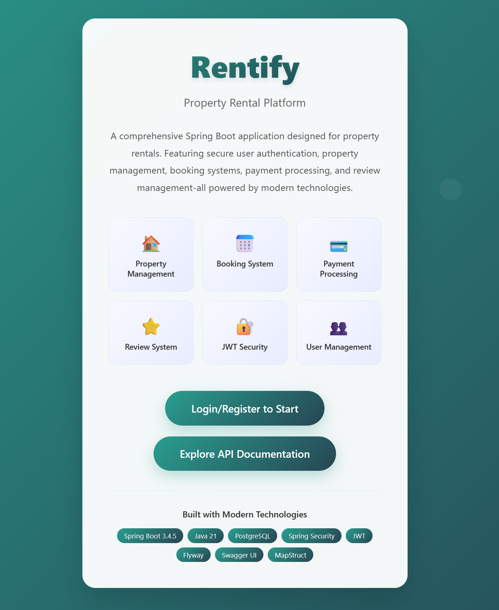
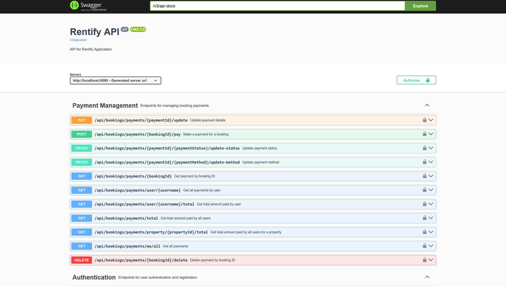
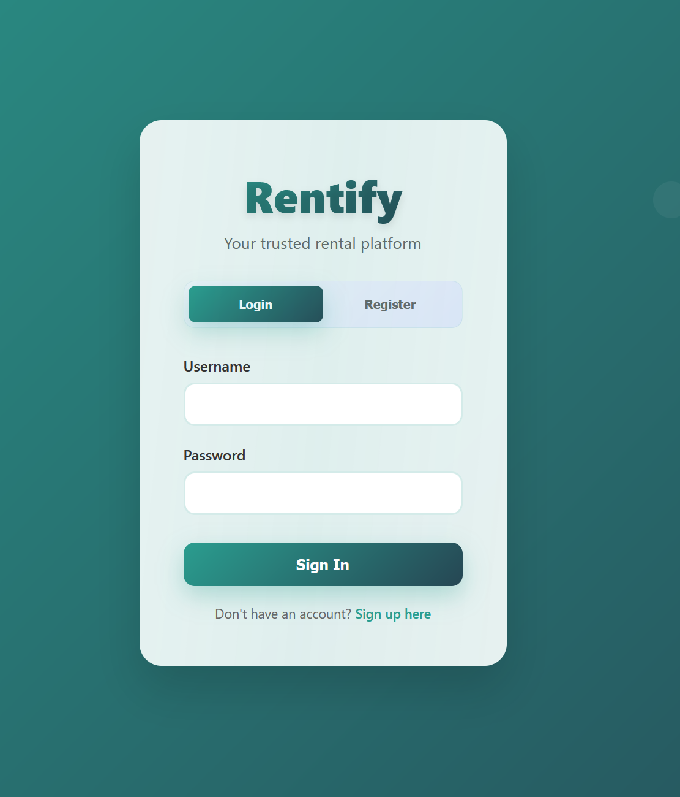
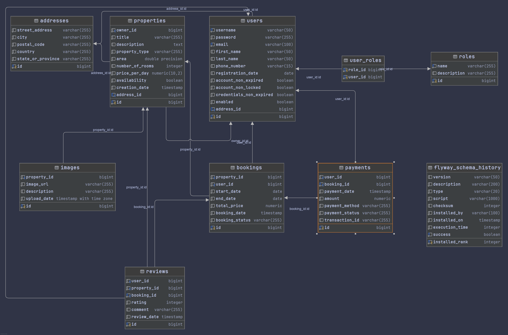
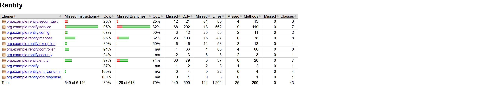

# Rentify

---

## Project Overview


Rentify is a web application designed to streamline the rental process for both landlords and tenants. It provides a platform for landlords to list their properties and for tenants to find suitable rentals. The application includes features such as property listings, tenant applications, and rental agreements.


---- 


## Features

*   **User Authentication & Authorization:** Secure login and registration using JWT, with role-based access control (USER, ADMIN).
*   **Property Management:** Create, read, update, and delete property listings. Filter properties by availability, location, and type.
*   **Booking System:** Allow users to book properties, manage booking statuses (pending, confirmed, cancelled).
*   **Payment Processing:** Simulate payment for bookings, track payment status and methods.
*   **Review System:** Users can leave reviews for properties after a completed booking.
*   **Image Management:** Upload and manage images for property listings.
*   **Role Management:** Admin interface for managing user roles.
*   **User Management:** Admin interface for managing users.
*   **Database Migrations:** Uses Flyway for managing database schema changes.
*   **API Documentation:** Interactive API documentation provided by Swagger UI.

-----


## Tech Stack

*   **Backend:** Java 21, Spring Boot 3.4.5
    *   Spring Web
    *   Spring Data JPA
    *   Spring Security
    *   Spring Validation
*   **Database:** PostgreSQL
*   **Authentication:** JWT (JSON Web Tokens)
*   **Database Migration:** Flyway
*   **Mapping:** MapStruct
*   **Utilities:** Lombok
*   **API Documentation:** Springdoc OpenAPI (Swagger UI)
*   **Build Tool:** Maven
*   **Containerization:** Docker, Docker Compose
*   **Testing:** JUnit 5, Mockito


----


## Prerequisites

*   JDK 21 or later
*   Maven 3.6.x or later
*   Docker and Docker Compose (Optional, for running with `docker-compose`)
*   PostgreSQL (If not using Docker)


---
## Getting Started

### 1. Clone the Repository

```bash
git clone https://github.com/DariuszMedrala/Rentify.git
cd Rentify
```

### 2. Configuration

The application uses `application.properties` for its configuration. For database credentials and the JWT secret, it's recommended to use environment variables, especially when running with Docker Compose.

Create a `.env` file in the root directory of the project with the following content:

```env
POSTGRES_DB=rentify_db
POSTGRES_USER=rentify_user
POSTGRES_PASSWORD=rentify_password
JWT_SECRET="your_very_secret_key" # Replace with a strong, unique secret for production
```

**Note:** The `JWT_SECRET` provided in the `docker-compose.yml` and above is an example. For production, generate a strong, unique secret (at least 32 bytes long).

If you are not using Docker, configure your PostgreSQL connection directly in `src/main/resources/application.properties`:

```properties
spring.datasource.url=jdbc:postgresql://localhost:5432/your_database_name
spring.datasource.username=your_postgres_user
spring.datasource.password=your_postgres_password
jwt.secret=your_strong_jwt_secret_here
```
Flyway will automatically handle database migrations upon application startup.

### 3. Running the Application

#### Option A: Using Docker Compose (Recommended)

This method will start the application and a PostgreSQL database instance.

```bash
docker-compose up --build
```

The application will be accessible at `http://localhost:8080`.

#### Option B: Using Maven

Ensure you have a PostgreSQL instance running and configured as per `application.properties`.

```bash
./mvnw spring-boot:run
```

The application will be accessible at `http://localhost:8080`.

-----


## API Documentation

Once the application is running, API documentation is available via Swagger UI at:

`http://localhost:8080/swagger-ui.html`

You can explore and interact with all available API endpoints here. Some endpoints require authentication.

-----------

## Default Admin User



Upon first startup, a default admin user and roles (ADMIN, USER) are created by the `DataInitializer`:
*   **Username:** `admin`
*   **Password:** `AdminPassword123!`
*   **Email:** `admin@rentify.com`

You can use these credentials to log in and access admin-specific functionalities using the Swagger UI or logging in through the frontend.

---------

## Project Structure

```
Rentify/
├── Dockerfile                # Defines the Docker image for the application
├── docker-compose.yml        # Docker Compose configuration for running app and DB
├── pom.xml                   # Maven project configuration
├── src/
│   ├── main/
│   │   ├── java/org/example/rentify/
│   │   │   ├── RentifyApplication.java  # Main Spring Boot application class
│   │   │   ├── config/                  # Security, Data Initialization
│   │   │   ├── controller/              # REST API controllers
│   │   │   ├── dto/                     # Data Transfer Objects
│   │   │   ├── entity/                  # JPA entities
│   │   │   ├── exception/               # Global exception handling
│   │   │   ├── mapper/                  # MapStruct mappers
│   │   │   ├── repository/              # Spring Data JPA repositories
│   │   │   ├── security/                # Security configurations, JWT utils
│   │   │   └── service/                 # Business logic services
│   │   └── resources/
│   │       ├── application.properties   # Application configuration
│   │       ├── db/migration/            # Flyway database migration scripts
│   │       └── static/                  # Static frontend files (index.html, login.html)
│   └── test/                            # Unit and integration tests
└── .mvn/                                # Maven wrapper files
```

------


## ER Diagram




-----------

## Testing

To run the unit and integration tests:

```bash
./mvnw test
```
Jacoco test coverage reports are generated during the test phase.
